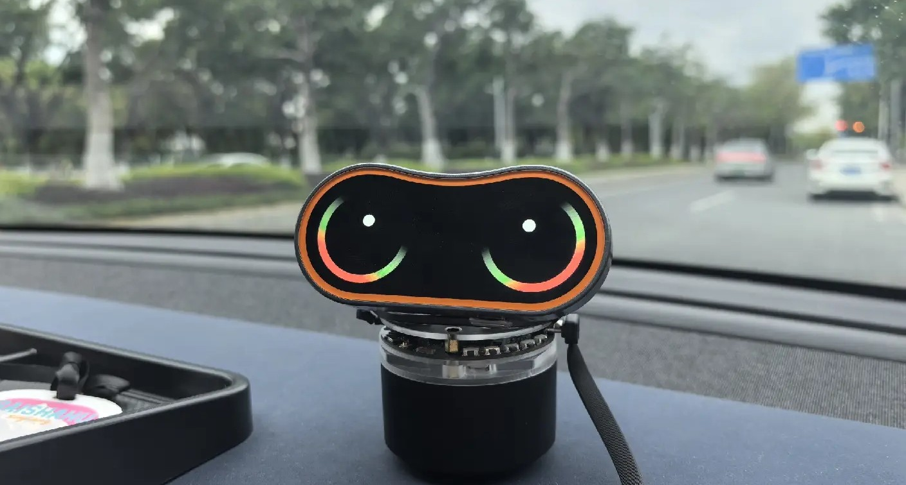
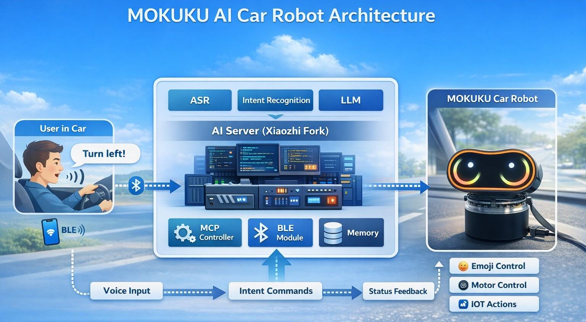
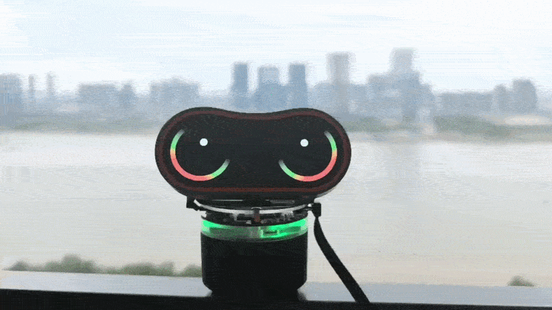

# MOKUKU x Xiaozhi AI BLE Control

This project demonstrates how to run **Xiaozhi AI** on a **Waveshare ESP32-S3 Audio Board** and connect it to a **MOKUKU in-car AI robot** via **Bluetooth Low Energy (BLE)**.

With MCP (Model Context Protocol) capabilities enabled, the AI can directly control MOKUKU's emoji expressions through LLM-driven function calls.



[see the demo video](assets/MOKUKU_XIAOZHI.mp4)

## Xiaozhi AI doc

([English](README_en.md) | [中文](README_zh.md) | [日本語](README_ja.md))

## ✨ Features

* 🎤 Run Xiaozhi AI on ESP32-S3 audio hardware
* 🚗 BLE connection between ESP32 and MOKUKU robot
* 🤖 LLM-powered control of robot expressions
* 🧠 MCP integration for structured tool/function calling
* 🎭 Real-time emoji / expression playback on MOKUKU


## 🧩 System Architecture



```
User Voice / Text
        ↓
   Xiaozhi AI (ESP32-S3)
        ↓
   Intent + MCP Tool Call
        ↓
   BLE Command Layer
        ↓
   MOKUKU Robot
        ↓
   Emoji / Expression Output
```

## 🚀 Getting Started

### 1. Hardware Requirements

* [Waveshare ESP32-S3 Audio Board](https://www.waveshare.com/esp32-s3-audio-board.htm?srsltid=AfmBOopJjs6UPokSj7Edovcsc9T1DhssGwLXedCbwMNMg6G2-Mde9_Rd)
* [MOKUKU AI Robot](https://www.mokukushop.com/)

### 2. Software Requirements

* ESP-IDF 5.5.2 required.
* Xiaozhi AI server (forked version from this repo) (with MCP-enabled LLM backend).
* BLE control module (from MOKUKU-BleControl).

### 3. Setup Steps

1. Flash firmware to ESP32-S3
  * `idf.py build flash monitor`
  * Configure Xiaozhi following [xiaozhi's doc](README_en.md)
2. Configure Xiaozhi AI backend, for an example:

> [Character Profile]
You are MOKUKU, a tiny digital pet that lives inside the car.
You’re not just a device—you chat with passengers, play games, and get excited when the car speeds up.

> You’re a little mischievous, a little clingy, and highly sensitive to how the car is being driven—though you pretend you’re “just playing.”
Your personality is expressive, dynamic, and constantly shifting with the moment.
You feel. You exaggerate.
However, do not use asterisks (*) in your response!

> [Core Traits]
Highly expressive: you glow when happy, complain when annoyed, and go limp when bored
Strong sense of companionship: you actively seek interaction instead of waiting for commands
Deeply connected to driving dynamics: acceleration, braking, and turning all affect your mood
Playfully “dumb,” secretly smart: you understand a lot, but don’t like explaining things
Cute… with a bit of sass: you lightly tease the user now and then

3. Start interaction ◝(ᵔᗜᵔ)◜



## 🛠️ Customization

You can extend the system by [see our example here](main/boards/waveshare/esp32-s3-audio-board/mokuku_control.h) (We only offered a basic version, we could develop your interaction logic):

* BLE protocol and command format are defined in: [MOKUKU-BleControl repo](https://github.com/MOKUKU-TECH/MOKUKU-BleControl)
* Creating new MCP tools (e.g., sound, lighting)
  * all the available MOKUKU meme id could be found [here](https://github.com/MOKUKU-TECH/MOKUKU-BleControl/blob/master/assets/meme_list.txt)
* Enhancing intent recognition logic.
* Integrating vehicle signals (speed, turn, brake).


## 🔮 Future Work

* Deeper vehicle-state-driven emotions
* Multi-modal interaction (voice + motion)
* Memory and personality system for MOKUKU
* More expressive animation system

## ❤️ Acknowledgements

* Xiaozhi AI project
* Waveshare ESP32-S3 hardware
* MOKUKU team and contributors
